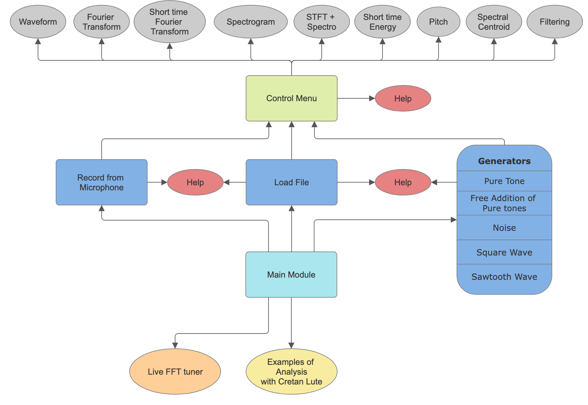

# Signal Visualizer: introducing singal processing concepts into musical education

## !Download and installation process described below.

## Description

Signal Visualizer is an application for musical education. It aims to show which are the most used frequency analysis techniques in a visual and interactive way. This application allows the following functions:

* Generation of signals.
* Imports of sounds.
* Recordings of new sounds.
* Real-time tuner using FFT spectrum.
* Example analysis of an acoustic instrument.
* Visualization of frequency analysis techniques.

It also contains user assistance and customization of the application.

The following image shows an schema of the architecture of the application:



As depicted in the figure, the solution comprises a set of subsidiary modules that depend on a main module. Based on their functionality, the modules are classified into the following types:

* **Main module**: The primary interface of the application. It provides access to other modules.
* **Generation modules**: These modules create a selection of synthetic sound signals for loading into the control menu window.
* **Input modules**: They serve to load real audio into the control menu window, whether audio files or recordings made in real-time.
* **Control menu module**: It allows to configure the parameters of different frequency analysis techniques and visualize the results.
* **FFT Tuner module**: This tool allows you to see in real-time the frequency spectrum captured by the microphone.
* **Example analysis module**: This new addition gives you the ability to observe interesting topics when analysing acoustic instruments (eg beat, instrument's eigen values and the phenomenom of resonance).
* **Help module**: It displays user assistance for each module.

The main module is positioned at the center of the diagram and is responsible for executing the other modules, as represented by arrows originating from it. When the user generates an audio signal via generation or input modules, they can always load it into the control menu window to analyze it. The help module is accessible from any generation and import module, as well as from the control menu module.

### GENERATION MODULES

The software can generate the following signals: pure tone, free addition of pure tones, square wave, sawtooth wave, and three types of noise. These modules have the objective of generating synthetic signals so the student can learn under which parameters they are calculated, and how the change of each parameter affects the resulting signal.

### INPUT MODULES

The input modules allow to load existing audio to the application and to record new sounds. The objective of these modules is to let the user choose the exact fragment they want to analyze by its frequency. There are two input modules: load and record.

### CONTROL MENU MODULE

The control menu module is the most important part of the application. The objective of this module is to teach students how frequency techniques work, the different elements involved in them, and how changing those elements affects the spectrum of the signal. It allows to toggle between different analysis techniques and to control the main configurable parameters for each technique. In this way, students learn to select the most suitable configuration to obtain the desired information. It focuses on nine different modes: the waveform, the Fourier Transform, the Short-Time Fourier Transform (which applies the Fourier transform to a windowed segment of the signal), the spectrogram, the short-time-energy, the pitch, the spectral centroid, and the filtering. Since the program allows opening multiple control menu windows with a navigation panel so you can find and navigate through all of your currently open windows, it is possible to compare the results of the analyses performed over different signals and with different parameter values.

### HELP MODULE

Each generation and import module, as well as the control menu window, contains a button to open the help window, which is a crucial component of the application. It not only provides information on the usage of each module, but also offers didactic explanations about the signal characteristics and the application of available frequency analysis techniques.

### REAL-TIME FFT TUNER MODULE

This module depicts the frequency spectrum captured by the microphone. It also has labels for different instruments so you can tune to the corresponding values. This is interesting as you can understand the different harmonic patterns produced by different instruments or voices in real-tme.

### EXAMPLES MODULE:

Here you can find plots of the waveform, the amplitude envelope, a spectrogram and a real time FFT all in sync to observe the pheonomenom of beats produced by 2 slightly de-tuned strings being tuned to the same pitch. Also the impulse response of an acoustic instrument is contained in the recordings inorder to show that different instruments have different eigen values. An educational-scientific explanation is offered for each phenomenom-recording.

## Installation


* **For MacOS/Linux:**
   1. Download the executable from the following link:
   
      https://ehubox.ehu.eus/s/pCewxd2jH3HF6xB?path=%2FMatt#

   2. Place the `library` folder in the same folder as `SignalVisualizer.app` (should be in the `dist` folder).
   3. Double-click the icon.

   * **Possible errors:**
      1. **No microphone input** (this is usually due to the application not having microphone permissions).
         * Try using the **"Record"** module before the **"Tuner"** module so that the permissions are granted.
         * Open the terminal, navigate to where the `.app` is located (should be in the `dist` folder), and run the following command:
            ```bash
            codesign --force --deep --sign - SignalVisualizer.app
            ```
         * If this still doesn’t work, try running the following command with the application open in the background, then reopen the application:
            ```bash
            tccutil reset Microphone
            ```

 * **For Windows:**
   1. Download the executable from the following link:
      
      https://ehubox.ehu.eus/s/pCewxd2jH3HF6xB?path=%2FMatt#

  	2. Place the "library" folder in the same folder as the `SignalVisualizer.exe` (should be in the dist folder).

 	3. Double click the icon.

 * **In case you want to rebuild the app from source(!working with Python 3.13.3):**

 	1. Navigate to the directory sigvis and run the following commnands:

 	```bash
 	pip install -r requirements.txt

 	pyinstaller --noconfirm --onefile --windowed \
    --name SignalVisualizer \
    # for mac only --add-binary="/System/Library/Frameworks/CoreAudio.framework:." \
    # for mac only --add-binary="/System/Library/Frameworks/AudioToolbox.framework:." \
    --add-data "html:html" \
    --icon=icons/icon.ico  \
    --exclude-module matplotlib.tests \
    --exclude-module scipy.extra-dll \
    --hidden-import="numpy" \
    --hidden-import="scipy.fft" \
    --hidden-import="pyaudio" \
    --hidden-import="PyQt5" \
    --hidden-import="matplotlib" \
    --optimize 2 \
    main.py

    ```

   2. Now that the dist folder has been created containing the .app or .exe right clikc to open Contents and add the file ```Info.plist``` in there.
    
   3. Now you can find the .exe/.app in the dist folder.


## Authors and acknowledgment

This application has been re-built/updated by Matteo Tsikalakis-Reeder, based on the original version, developed by Leire Varela Aranguren. Both under the supervision of Inma Hernáez Rioja.


